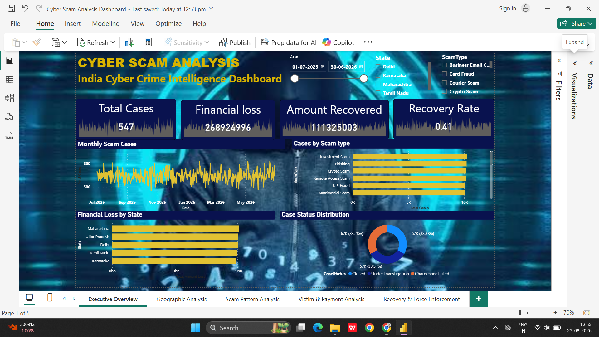
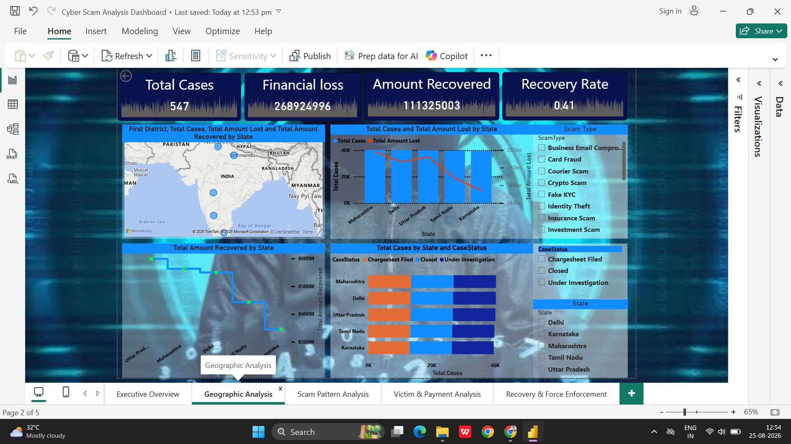
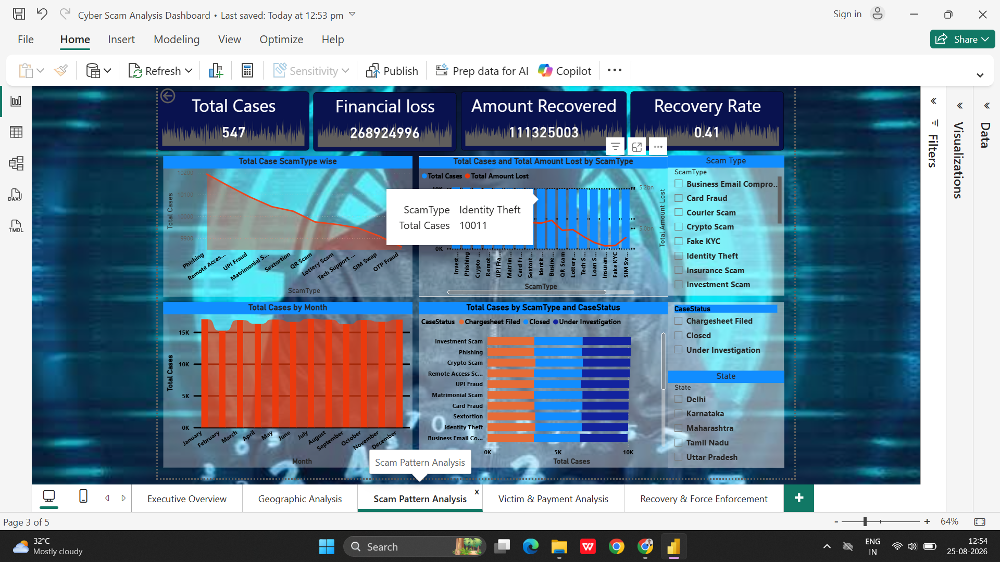
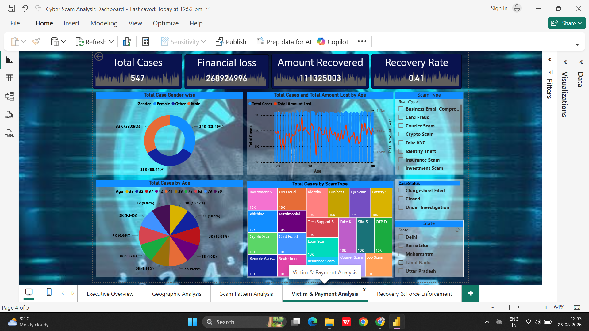
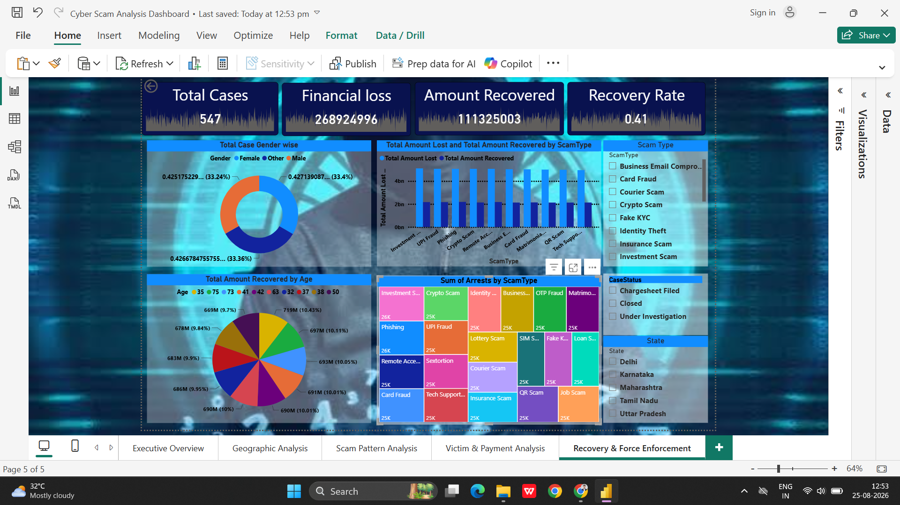

# Cyber Scam Analysis – Power BI Dashboard

## 📊 Project Overview

This project analyzes cyber scam cases using Microsoft Power BI to identify scam patterns, geographic trends, financial losses, recovery performance, and case outcomes.

## 🎯 Objectives

* Analyze total cyber scam cases
* Identify major scam types
* Analyze state-wise scam activity
* Measure financial losses
* Analyze recovered amounts
* Calculate recovery rate
* Analyze case status and outcomes
* Identify trends over time

## 🛠️ Tools & Technologies

* Microsoft Power BI
* Power Query
* DAX
* Microsoft Excel

## 📌 Dashboard Pages

### 1. Executive Overview

Provides a high-level summary of total cases, financial loss, recovered amount, recovery rate, scam trends, scam types, and case status.

### 2. Geographic Analysis

Analyzes cyber scam cases, financial losses, recovery, and case status across different states.

### 3. Scam Pattern Analysis

Analyzes scam types, financial impact, trends over time, and case status by scam category.

### 4. Victim & Payment Analysis

Provides an analytical view of cases, financial impact, and payment-related patterns using the available dataset fields.

### 5. Recovery & Force Enforcement

Analyzes recovered amounts, recovery rate, case outcomes, and recovery trends.

## 📈 Key KPIs

* Total Cases
* Total Amount Lost
* Total Amount Recovered
* Recovery Rate %

## 🔍 Key Analysis

The dashboard provides interactive analysis using filters such as:

* State
* Scam Type
* Date
* Case Status

## 📷 Dashboard Preview

### Executive Overview

### Geographic Analysis

### Scam Pattern Analysis

### Victim & Payment Analysis

### Recovery & Force Enforcement

## 📂 Project Files

* `Cyber-Scam-Analysis-PowerBI.pbix` – Power BI dashboard
* `Screenshots/` – Dashboard page previews
* `Dataset/` – Source dataset, if suitable for public sharing

## 👨‍💻 Author

**Khushi Sharma**
